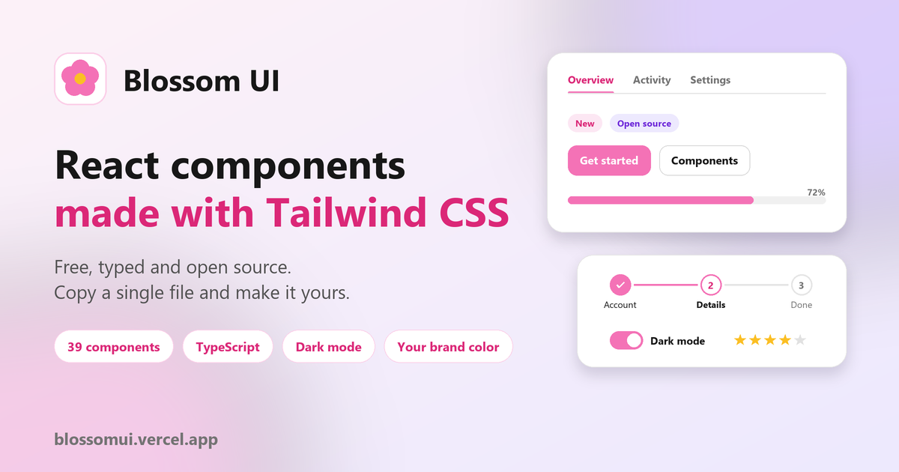
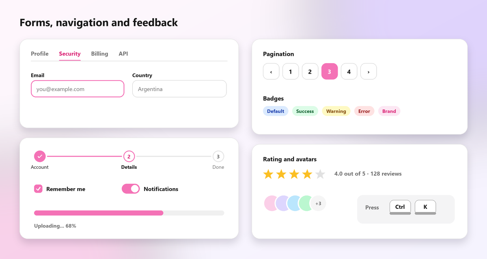
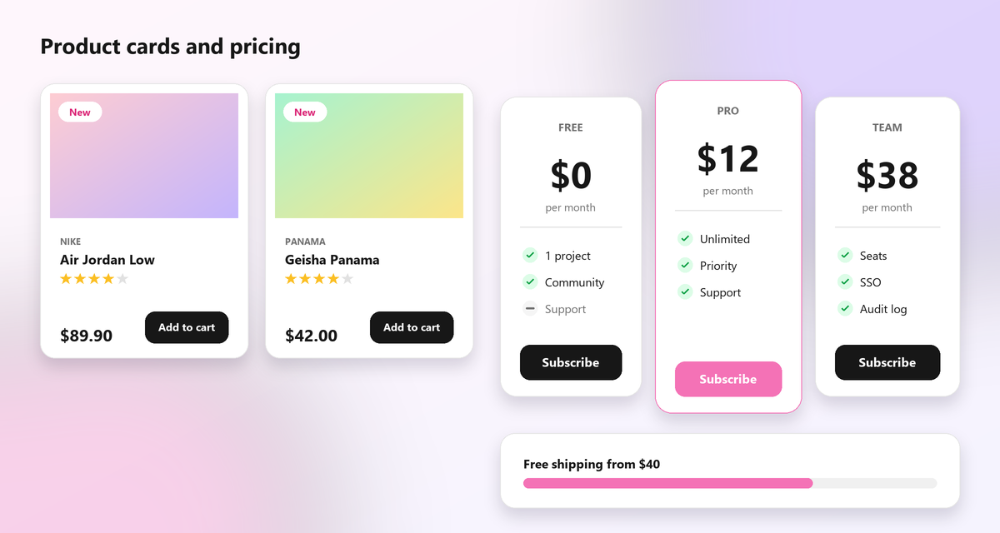
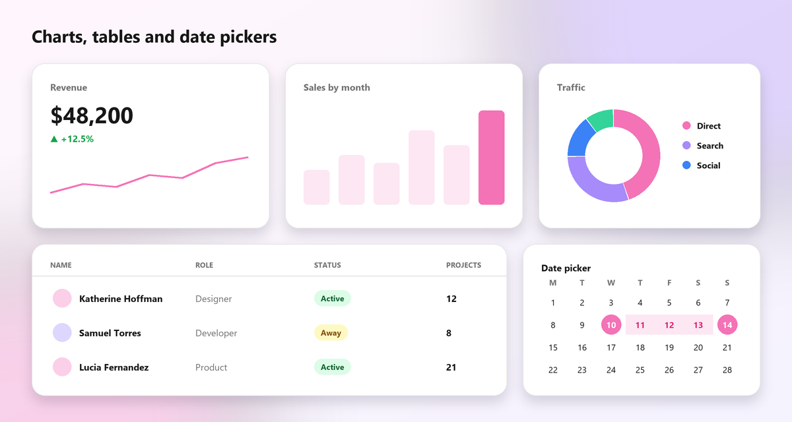

<p align="center">
  
</p>

# Blossom UI

**Blossom UI** is a library of free and open source React components written in TypeScript and styled with Tailwind CSS. There is nothing to install: every component is a **single file with typed props** that you copy into your project and make yours.

[Live site and documentation](https://blossomui.vercel.app/) · [Components](https://blossomui.vercel.app/components) · [Changelog](https://blossomui.vercel.app/docs/getting-started/changelog)

## Why Blossom UI

- **Copy and paste.** No package, no lock-in. Open a component page, copy the file, import it.
- **Typed.** Props and interfaces are written in TypeScript, so your editor suggests them.
- **Interactive and accessible.** Modals, selects, menus, date pickers and the rest manage their own state with React hooks, work with the keyboard and use ARIA.
- **Dark mode** in every component (Tailwind `class` strategy).
- **Your brand.** One CSS variable changes the accent everywhere, and the components with colors accept any CSS color.
- **Translatable.** Every text has a `labels` prop, and prices and dates follow your locale.
- **No dependencies** besides React and Tailwind: the charts are plain SVG and the icons are the ones you choose.

## Components

Alerts, Accordion, Avatar, Badges, Banner, Breadcrumb, Buttons (and icon buttons), Carousel, Cards (and product cards with photo gallery), Charts, Chip input, Command palette, Date picker (with range), Drawer, Dropdown, Empty state, File upload, Footer, Forms (input, textarea, select, multi select, checkbox, radio, switch), Jumbotron, KBD, Modal, Navbar, Pagination, Popover, Pricing, Progress, Rating, Skeleton, Slider, Spinners, Stats, Stepper, Survey, Table, Tabs, Timeline, Toasts and Tooltip.

## Quick start

1. Use a React 18 project (Vite, Next.js or any other) with **Tailwind CSS 3.3 or newer** and `darkMode: 'class'`.
2. Open the page of a component in the [documentation](https://blossomui.vercel.app/components), copy its file to `src/components/ui/`.
3. Import it:

```tsx
import { Button } from './components/ui/Button'

export default function App() {
  return <Button color="primary">Example button</Button>
}
```

Some components import another file of the library (for example `accent.ts` or `Tooltip.tsx`). The page of each component lists them.

## Your brand color

Set the accent once in your CSS. Tabs, pagination, steppers, form controls, focus rings and the rest follow it.

```css
:root { --blossom-accent: #0f766e; --blossom-accent-contrast: #ffffff; }
.dark { --blossom-accent: #5eead4; --blossom-accent-contrast: #042f2e; }
```

Buttons, badges, alerts, toasts, progress bars, spinners and keys use it with `color="accent"`, and they also take any CSS color:

```tsx
<Button color="accent">Buy now</Button>
<Badge color="#7c3aed">New</Badge>
<Tabs tabs={tabs} color="#0f766e" />
```

## Translate it

```tsx
<Pagination
  page={page}
  total={8}
  onChange={setPage}
  labels={{ previous: 'Anterior', next: 'Siguiente', page: (n) => `Página ${n}` }}
/>

<ProductCard image={image} name="Zapatillas" price={89900}
  formatPrice={(value) => new Intl.NumberFormat('es-AR', { style: 'currency', currency: 'ARS' }).format(value)}
  labels={{ addToCart: 'Agregar al carrito' }}
/>
```

## Preview

Forms, navigation and feedback:



Product cards and pricing:



Charts, tables and date pickers:



And much more! [Visit the live site](https://blossomui.vercel.app/).

## Run the documentation locally

```bash
git clone https://github.com/juanigarciadev/BlossomUI
cd BlossomUI
npm install
npm run dev
```

The site is built with [Vite](https://vitejs.dev/), [React](https://react.dev/), [Tailwind CSS](https://tailwindcss.com/) and [Framer Motion](https://www.framer.com/motion/), and deployed on [Vercel](https://vercel.com/). Icons in the examples are from [Lucide](https://lucide.dev/), but the components do not depend on any icon library.

## About

This project started as a personal challenge to improve my programming skills, always focused on helping others: a free library so nobody has to build a design system from scratch and lose time in their projects. It is built by one person, so contributions are very welcome. Anyone can review and open a pull request to add, improve or fix any component.

## Support

If Blossom UI saves you time, you can [support me via GitHub Sponsors](https://github.com/sponsors/juanigarciadev).
